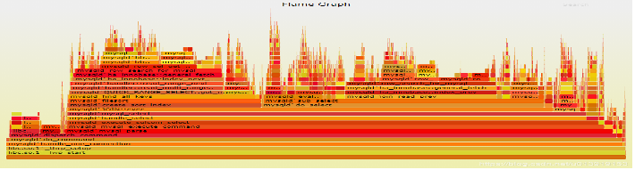

## Linux系统性能分析

### top 使用技巧
* `top -H` 按照线程查看，或者启动top之后按 H 也可以
* `top` 按照进程查看
* `top -H | grep <>` 按照筛选项查看

参考博客： 
[Linux top命令详解：持续监听进程运行状态](http://c.biancheng.net/view/1065.html)

在⽬前的多核架构下，不同版本的 top 对占有率的定义是有差别的，例如 toybox 版本显⽰
的CPU占有率是针对单 核的，也就是说如果SOC有四个核，线程A如果占满⼀个核，那 toybox
显⽰的占有率是100%。⽽ busybox 则与之相反，其占有率是按所有CPU核来算的，同样场景下
线程A的占有率只会显⽰25%。总的说来，对⽐CPU占有率， 最好⽤同⼀个版本的 top 来对⽐
才是最准的。


还有就是要注意top也是有精度的，它的原理是读取内核提供的进程信息`/proc/pid/stat`
和`/proc/stat`，所 以它完全依赖于Linux内核的调度粒度和使⽤场景。举个例⼦， stat
统计的单位是jiffies，假设⽬前内核的HZ设的 是300，并且启⽤了⾼精度定时器，那差不多
就是3ms⼀个jiffies，如果进程A以1ms甚⾄更⼩的间隔重复去睡眠，然后起来做⼀点事情，
那就可能出现这个3ms中进程A实际执⾏了挺多次，但是由于3ms间隔起始和结束刚好这个CPU
都在执⾏ idle 进程，这个3ms就被算到 idle 进程⾝上了。所以，在HZ设置的⽐较⼩，进程
又频繁的⼩跑⼩睡的场景下，其 idle 进程的统计会有⼀些误差，CPU占有率越低，idle误差
越⼤。

**选项：**
```shell
    -d 秒数：指定 top 命令每隔几秒更新。默认是 3 秒；
    -b：使用批处理模式输出。一般和"-n"选项合用，用于把 top 命令重定向到文件中；
    -n 次数：指定 top 命令执行的次数。一般和"-"选项合用；
    -p 进程PID：仅查看指定 ID 的进程；
    -s：使 top 命令在安全模式中运行，避免在交互模式中出现错误；
    -u 用户名：只监听某个用户的进程；
```

在 top 命令的显示窗口中，还可以使用如下按键，进行一下交互操作：
```shell
    ? 或 h：显示交互模式的帮助；
    P：按照 CPU 的使用率排序，默认就是此选项；
    M：按照内存的使用率排序；
    N：按照 PID 排序；
    T：按照 CPU 的累积运算时间排序，也就是按照 TIME+ 项排序；
    k：按照 PID 给予某个进程一个信号。一般用于中止某个进程，信号 9 是强制中止的信号；
    r：按照 PID 给某个进程重设优先级（Nice）值；
    q：退出 top 命令；
    1：将cpu核心展开显示，而不是统计显示
    H：切换到线程状态，再按切回到任务状态
    F：选择指定的列显示
    U：筛选用户
    V：按照树状图显示
```

**第一部分的作用**
```shell
第一行为任务队列信息
    12:26:46	                    系统当前时间
    up 1 day, 13:32	                系统的运行时间.本机己经运行 1 天 13 小时 32 分钟
    2 users	                        当前登录了两个用户
    load average: 0.00,0.00，0.00	系统在之前 1 分钟、5 分钟、15 分钟的平均负载。
                                    如果 CPU 是单核的，则这个数值超过 1 就是高负载：
                                    如果 CPU 是四核的，则这个数值超过 4 就是高负载
                                    （这个平均负载完全是依据个人经验来进行判断的，
                                    一般认为不应该超过服务器 CPU 的核数）

第二行为进程信息
    Tasks: 95 total	系统中的进程总数
    1 running	    正在运行的进程数
    94 sleeping	    睡眠的进程数
    0 stopped	    正在停止的进程数
    0 zombie	    僵尸进程数。如果不是 0，则需要手工检查僵尸进程

第三行为 CPU 信息
    Cpu(s): 0.1 %us	用户模式占用的 CPU 百分比
    0.1%sy	        系统模式占用的 CPU 百分比
    0.0%ni	        改变过优先级的用户进程占用的 CPU 百分比
    99.7%id	        空闲 CPU 占用的 CPU 百分比
    0.1%wa	        等待输入/输出的进程占用的 CPU 百分比
    0.0%hi	        硬中断请求服务占用的 CPU 百分比
    0.1%si	        软中断请求服务占用的 CPU 百分比
    0.0%st	        st（steal time）意为虚拟时间百分比，就是当有虚拟机时，虚拟
                    CPU 等待实际 CPU 的时间百分比

第四行为物理内存信息
    Mem: 625344k total	物理内存的总量，单位为KB
    571504k used	    己经使用的物理内存数量
    53840k&ee	        空闲的物理内存数量。我们使用的是虚拟机，共分配了 628MB内存，
                        所以只有53MB的空闲内存
    65800k buffers	    作为缓冲的内存数量

第五行为交换分区（swap）信息
    Swap: 524280k total	交换分区（虚拟内存）的总大小
    Ok used	            已经使用的交换分区的大小
    524280k free	    空闲交换分区的大小
    409280k cached	    作为缓存的交换分区的大小

解释一下缓冲（buffer）和缓存（cache）的区别：
1. 缓存（cache）是在读取硬盘中的数据时，把最常用的数据保存在内存的缓存区中，再次
   读取该数据时，就不去硬盘中读取了，而在缓存中读取。
2. 缓冲（buffer）是在向硬盘写入数据时，先把数据放入缓冲区,然后再一起向硬盘写入，
   把分散的写操作集中进行，减少磁盘碎片和硬盘的反复寻道，从而提高系统性能。简单
   来说，缓存（cache）是用来加速数据从硬盘中"读取"的，而缓冲（buffer）是用来加速
   数据"写入"硬盘的。
```

**第二部分的作用**
```shell
top 命令的第二部分输出，主要是系统进程信息，各个字段的含义如下：
    PID：进程的 ID。
    USER：该进程所属的用户。
    PR：优先级，数值越小优先级越高。
    NI：优先级，数值越小、优先级越高。
    VIRT：该进程使用的虚拟内存的大小，单位为 KB。
    RES：该进程使用的物理内存的大小，单位为 KB。
    SHR：共享内存大小，单位为 KB。
    S：进程状态。
    %CPU：该进程占用 CPU 的百分比。
    %MEM：该进程占用内存的百分比。
    TIME+：该进程共占用的 CPU 时间。
    COMMAND：进程的命令名。
```
Linux系统可以使用 htop ，与 top 功能类似


### android 系统性能分析

referendes:
[系统跟踪概览](https://developer.android.google.cn/topic/performance/tracing/?hl=zh-cn)

#### ftrace

函数跟踪（function trace）这是Linux内核提供的功能，所有使用Linux内核的系统都有
该功能（包括Linux和Android），其功能远不止名称所包含的内容，它可以用于测量处理
中断所需要的时间、跟踪耗时函数、计算激活高优先级任务的时间、跟踪上下文切换等。
具体使用方法可以参考书籍《Linux设备驱动开发》（[美]约翰·马德奥 李强 译）(已购)。
也可参考内核文档：[ftrace.rst](https://www.kernel.org/doc/Documentation/trace/ftrace.txt)

#### atrace

reference:
* [Android atrace使用说明(Android sdk中的systrace)](http://bcoder.com/java/android-atrace-systrace-usage-instruction)
* [Android atrace/systrace的使用](https://juejin.cn/post/7053395801510248455)

Android tracer，使用ftrace来跟踪Android上层的函数调用。为数据采集部分

```
rk3588_s:/ # atrace -h
atrace: invalid option -- h

usage: atrace [options] [categories...]
options include:
  -a appname      enable app-level tracing for a comma separated list of cmdlines;
                  * is a wildcard matching any process
  -b N            use a trace buffer size of N KB
  -c              trace into a circular buffer
  -f filename     use the categories written in a file as space-separated
                    values in a line
  -k fname,...    trace the listed kernel functions
  -n              ignore signals
  -s N            sleep for N seconds before tracing [default 0]
  -t N            trace for N seconds [default 5]
  -z              compress the trace dump
  --async_start   start circular trace and return immediately
  --async_dump    dump the current contents of circular trace buffer
  --async_stop    stop tracing and dump the current contents of circular
                    trace buffer
  --stream        stream trace to stdout as it enters the trace buffer
                    Note: this can take significant CPU time, and is best
                    used for measuring things that are not affected by
                    CPU performance, like pagecache usage.
  --list_categories
                  list the available tracing categories
 -o filename      write the trace to the specified file instead
                    of stdout.
```

`atrace  --list_categories` 可以查看更多策略

```
1|rk3588_s:/ # atrace  --list_categories
         gfx - Graphics
       input - Input
        view - View System
     webview - WebView
          wm - Window Manager
          am - Activity Manager
          sm - Sync Manager
       audio - Audio
       video - Video
      camera - Camera
         hal - Hardware Modules
         res - Resource Loading
      dalvik - Dalvik VM
          rs - RenderScript
      bionic - Bionic C Library
       power - Power Management
          pm - Package Manager
          ss - System Server
    database - Database
     network - Network
         adb - ADB
    vibrator - Vibrator
        aidl - AIDL calls
       nnapi - NNAPI
         rro - Runtime Resource Overlay
         pdx - PDX services
       sched - CPU Scheduling
         irq - IRQ Events
         i2c - I2C Events
        freq - CPU Frequency
        idle - CPU Idle
        disk - Disk I/O
         mmc - eMMC commands
        load - CPU Load
        sync - Synchronization
       workq - Kernel Workqueues
  memreclaim - Kernel Memory Reclaim
  regulators - Voltage and Current Regulators
  binder_driver - Binder Kernel driver
  binder_lock - Binder global lock trace
   pagecache - Page cache
      memory - Memory
     thermal - Thermal event
```

```
ex: atrace -z -b 4000 gfx input view webview wm am camera hal res audio video
dalvik rs ss sched freq idle disk mmc -t 15 > /data/trace_output
```


#### systrace

systrace：Android的 trace 数据分析工具，将 atrace 采集上来的数据，以图形化的方式
展现出来。

Systrace实际上是一些工具的集合，在设备端使用atrace来控制用户空间的tracing和设置
ftrace，kernel中使用tracing机制进行数据采集。Systrace最终读取ftrace的buffer，然后
将数据打包以HTML文件的方式呈现。

```
downlaod https://android.googlesource.com/platform/external/chromium-trace/+/6de8cfafb37437313122d1d78536749c02c3398c/systrace.py

./systrace.py --from-file trace_output -o trace_output.html
```

```
reference: https://juejin.cn/post/7053395801510248455

按键操作       作用
w             放大，[+shift]速度更快
s             缩小，[+shift]速度更快
a             左移，[+shift]速度更快
d             右移，[+shift]速度更快

f             放大当前选定区域
m             标记当前选定区域
v             高亮VSync
g             切换是否显示60hz的网格线
0             恢复trace到初始态，这里是数字0而非字母o

h             切换是否显示详情
/             搜索关键字
enter　　　　　　显示搜索结果，可通过← →定位搜索结果
`             显示/隐藏脚本控制台
?             显示帮助功能
```


#### Perfetto

reference:
* [Android 系统使用 Perfetto 抓取 trace 教程](https://zhuanlan.zhihu.com/p/508526020)
* [Perfetto工具使用简介](https://www.jianshu.com/p/ab22238a9ab1)

Perfetto工具是Android下一代全新的统一的trace收集和分析框架，可以抓取平台和app的
trace信息，是用来取代systrace的，但systrace由于历史原因也还会一直存在，并且Perfetto
抓取的trace文件也可以同样转换成systrace视图，如果习惯用systrace的，可以用Perfetto UI
的"Open with legacy UI"转换成systrace视图来看

Perfetto 是基于 Android 的系统追踪服务， 这个配置在 Android11(R) 之后是默认打开的，
但是如果你是 Android 9 (P) 或者 10 (Q) ，那么就需要手动设置一下相应的 prop 属性。

```shell
# Needed only on Android 9 (P) and 10 (Q) on non-Pixel phones.
adb shell setprop persist.traced.enable 1
```
在设置完 trace 服务可用后，下面我们就可以开始抓取相应的 trace 了。目前，主要有两个
方式可以实现 trace 抓取。一个是通过命令行抓取，一个是通过 Perfetto UI 在线抓取。

##### 命令行抓取

命令行抓取 trace 方式的前提是你的电脑是已经安装了 adb 驱动，电脑能够通过 adb 命令
成功连接到你的 Android 设备

使用命令行抓取又可以分为两种方式：
* 使用 Android 设备预置的 perfetto 执行程序
* 使用谷歌推荐的 record_android_trace 脚本

执行抓取命令：
```shell
adb shell perfetto -o /data/trace_file.perfetto-trace -t 5s sched freq idle am wm
 gfx view binder_driver hal dalvik camera input res memory

其中：
-o /data/trace_file.perfetto-trace
# -o 表示抓取文件的输出目录，这里我们是输出到 /data/ 目录下的 trace_file.perfetto-trace 文件。
-t 5s
# -t 表示抓取的时间，这里设置了 5s，默认情况下是 10s。
sched freq idle am wm gfx view binder_driver hal dalvik camera input res memory
# 这里表示我们想要抓 trace 的相关模块。
```

注意: 如果通过 adb shell perfetto 的方式抓取 trace ，需要我们手动执行 ctrl + c 结束
我们的抓取操作。抓取的文件被保存在了 /data/trace_file.perfetto-trace 中。

抓取成功之后可以将文件放到网站可视化页面上显示（https://ui.perfetto.dev/#!/viewer）

另外命令行执行较复杂，我们可以通过 config 文件执行，Perfetto 为我们提供了一种更
方便更加灵活的配置化式的 trace 抓取方案： trace config 。让我们先来看一下官方提供
的 config 样例 config.pbtx：
```
# perfetto run time
duration_ms: 5000

buffers: {
    size_kb: 8960
    fill_policy: DISCARD
}
buffers: {
    size_kb: 1280
    fill_policy: DISCARD
}
data_sources: {
    config {
        name: "linux.ftrace"
        ftrace_config {
            ftrace_events: "sched/sched_switch"
            ftrace_events: "power/suspend_resume"
            ftrace_events: "sched/sched_process_exit"
            ftrace_events: "sched/sched_process_free"
            ftrace_events: "task/task_newtask"
            ftrace_events: "task/task_rename"
            ftrace_events: "ftrace/print"
            atrace_categories: "gfx"
            atrace_categories: "view"
            atrace_categories: "webview"
            atrace_categories: "camera"
            atrace_categories: "dalvik"
            atrace_categories: "power"
            atrace_categories: "sched"
            atrace_categories: "freq"
            atrace_categories: "idle"
            atrace_categories: "am"
            atrace_categories: "wm"
            atrace_categories: "binder_driver"
            atrace_categories: "hal"
            atrace_categories: "input"
            atrace_categories: "res"
            atrace_categories: "memory"
        }
    }
}
data_sources: {
    config {
        name: "linux.process_stats"
        target_buffer: 1
        process_stats_config {
            scan_all_processes_on_start: true
        }
    }
    # Enable the data source only on Chrome and Chrome canary. maybe not work?
    producer_name_filter: "com.android.chrome"
    producer_name_filter: "com.google.chrome.canary"
    # producer_name_filter: "mpi_dec_test -i /sdcard/benfan.h264"
}
```


注意，这是一个以 .pbtx 为后缀名的文件，使用时，我们需要先将这个文件 push 到手机
目录下，而后执行如下抓取命令：

```shell
adb push config.pbtx /sdcard/
adb shell 'cat /sdcard/config.pbtx | perfetto --txt -c - -o /data/trace.perfetto-trace'
# 这里 -c - 应该是指从管道获取配置，也可以按如下执行：
adb shell perfetto --txt -c /sdcard/config.pbtx -o /data/trace.perfetto-trace
```

##### record_android_trace 抓取

除了 adb shell perfetto 的方式，Perfetto 还帮我们提供了一个保姆式服务的抓取脚本
record_android_trace ，它其实跟 adb shell perfetto 是同样的效果，但是它帮我们实现了
傻瓜式操作，只要执行下脚本命令，后续文件抓好后会自动导入网页解析展示出来，我们直接
开始分析就行，这也是 Perfetto 推荐的抓取方法。

record_android_trace 获取方式：
```
curl -O https://raw.githubusercontent.com/google/perfetto/master/tools/record_android_trace
```
搭配上面讲到的 config 方式，执行如下命令即课可开启抓取：
```shell
python record_android_trace.py -c config.pbtx -o trace_file.perfetto-trace
```
执行完上述命令后，脚本会自动帮我们把抓到的文件导入浏览器，并可视化展现，非常方便。

##### Perfetto UI 抓取

除了上面的命令行抓取方式外，Perfetto 还提供了一种网页抓取的方式 [Perfetto UI](https://ui.perfetto.dev/#!/record)。

通过网页的方式抓取要保证电脑连接你的 Android 设备后，网页端也要识别到设备的存在。
然后点击右侧的 Record new trace 即可开始抓取。如果我们需要配置抓取的规则，可以通过
下面的配置页面进行设置，比如抓取时长，buffer 大小等。


#### simpleperf

references:
[【Simpleperf】Android的CPU分析，性能优化利器](https://blog.csdn.net/qq_38410730/article/details/103481429)


Simpleperf 是 Android 的原生 CPU 分析工具。 它可用于分析 Android 应用程序和在
Android 上运行的本机进程。 simpleperf 可执行文件可以在 Android >=L 上运行，而
Python 脚本可以在 Android >= N 上使用。

使用simpleperf采集数据
```
simpleperf record -p 348 -g --duration 10 -o /mnt/media_rw/sda1/simpleperf_mcu.data
```

将simpleperf_mcu.data拷贝到系统源码目录android/system/extras/simpleperf/scripts/
cd android/system/extras/simpleperf/scripts/
python report_sample.py simpleperf_mcu.data > simpleperf_mcu_report.data


Simpleperf是NDK软件包中提供的一种多功能命令行工具，方便为Android应用流程执行CPU分析。
也就是说，Simpleperf是NDK自带的工具，官方认证的CPU分析工具。Simpleperf是Android平台
的一个本地层性能分析工具。它的命令行界面支持与linux-tools perf大致相同的选项，但是
它还支持许多Android特有的改进。

Simpleperf的获取路径：[Google Git Simpleperf](https://android.googlesource.com/platform/prebuilts/simpleperf/)


##### Simpleperf的工作原理

现代的CPU具有一个硬件组件，称为性能监控单元(PMU)。PMU具有一些硬件计数器，计数一些
诸如经历了多少次CPU周期，执行了多少条指令，或发生了多少次缓存未命中等的事件。Linux
内核将这些硬件计数器包装到硬件perf事件(hardware perf events)中。此外，Linux内核还
提供了独立于硬件的软件事件和跟踪点事件。Linux内核通过perf_event_open系统调用将这些
都暴露给了用户空间。这正是simpleperf所使用的机制。

Simpleperf具有三个主要的功能：stat、record和report。

Stat命令给出了在一个时间段内被分析的进程中发生了多少事件的摘要。以下是它的工作原理：
* 给定用户选项，simpleperf通过对linux内核进行系统调用来启用分析；
* Linux 内核在调度到被分析进程时启用计数器；
* 分析之后，simpleperf从内核读取计数器，并报告计数器摘要。

Record命令在一段时间内记录剖析进程的样本。它的工作原理如下：
* 给定用户选项，simpleperf通过对linux内核进行系统调用来启用分析；
* Simpleperf在simpleperf和linux内核之间创建映射缓冲区；
* Linux内核在调度到被分析进程时启用计数器；
* 每次给定数量的事件发生时，linux内核将样本转储到映射缓冲区；
* Simpleperf从映射缓冲区读取样本并生成perf.data。

Report命令读取perf.data文件及所有被剖析进程用到的共享库，并输出一份报告，展示时间
消耗在了哪里。

##### Simpleperf的使用

```shell
#==> stat
simpleperf stat [options] [command [command-args]]
# 获取一段时间内已分析进程中发生的事件数摘要。 最常使用的选项为：
simpleperf stat -p <进程号> --duration <检测进程的持续时间(秒)>

#==> record
simpleperf record [options] [command [command-args]]
# 记录一段时间内已分析进程的样本，这是simpleperf的主命令。最常使用的选项为：
simpleperf record -p <进程号> -o <输出文件(默认perf.data)> --duration <监测进程的持续时间(秒)>
# 需要注意的是，如果出现Access to kernel symbol addresses is restricted的警告，
# 需要使用以下命令来取消
echo 0>/proc/sys/kernel/kptr_restrict

#==> report methed1
simpleperf report [options]
# 读取perf.data文件(由simpleperf record创建)，并显示报告，表明花费时间的地方。最常使用的选项为：
simpleperf report --dsos <选定动态共享对象(so库)>  -f <记录文件(默认perf.data)> --sort <用于排序和打印报告的键> -n

#==> report  methed2
# 使用NDK转数据，使用FlameGraph生成图片
~/work/android/ndk/android-ndk-r23b/simpleperf/report_sample.py ./perf.data > out.perf
~/Projects/FlameGraph/stackcollapse-perf.pl out.perf > out.foled
~/Projects/FlameGraph/flamegraph.pl out.foled > out.svg
```

应用实例：
```shell
#==> report  methed1
# -g 意味着抓取的数据含有堆栈信息，如果不加 -g 最终生成的火焰图效果不好，无法形成堆栈的火焰状态
simpleperf record -g mpi_dec_test -i /sdcard/benfan.h264
# 生成命令行的解析，-g 参数会显示调用堆栈，不然会平铺
python3 ${HOME}/work/android/ndk/android-ndk-r23b/simpleperf/report.py -g -i perf.data
# 生成html文件
python3 ${HOME}/work/android/ndk/android-ndk-r23b/simpleperf/report_html.py -i perf.data


#==> report  methed2
# 使用NDK转数据，使用FlameGraph生成图片
~/work/android/ndk/android-ndk-r23b/simpleperf/report_sample.py ./perf.data > out.perf
~/Projects/FlameGraph/stackcollapse-perf.pl out.perf > out.foled
~/Projects/FlameGraph/flamegraph.pl out.foled > out.svg
```

tips:
如果想html的火焰图都放在一张图上，需要修改ndk里的源码
```
# ndk/android-ndk-r23b/simpleperf/inferno/inferno.py

    args = parser.parse_args()
    # 新加这行代码
    args.one_flamegraph = True
    process = Process("", 0)

    if not args.skip_collection:
        if args.pid != -1:
            process.pid = args.pid

# 然后执行：
~/work/android/ndk/android-ndk-r23b/simpleperf/inferno.sh -sc --record_file ./perf.data
# 可以将火焰图放在一张图上

# 使用 FlameGraph 是直接放在一张图上的
```


**注意**:
如果使用report命令进行查找的时候，发现so现实的Symbol都是地址，而不是函数内容。
这多数是因为在安卓编译的时候，设备上使用的so库已经被strip过，也就是说，已经抛离了.
symbol段的内容。那么，我们需要将带有Symbol信息的so下载到设备上。同时需要将so放置
到perf.data中记录的相同的路径(否则，simpleperf无法找到它)。如果找不到路径，可以在
perf.data文件中直接搜索需要选定的so库的名称，即可查看到路径。

#### kernelshare

待完善

### perf （Linux性能分析工具）

references:
* [linux 性能分析工具perf使用详解](https://blog.csdn.net/cyq6239075/article/details/104371328)
* [perf的基本使用方法](https://blog.csdn.net/jasonactions/article/details/109332167)

Perf包含22种子工具的工具集，以下是最常用的5种：
* Perf-list：用来查看perf所支持的性能事件，有软件的也有硬件的。
* perf-stat：用于分析指定程序的性能概况。
* perf-top：对于一个指定的性能事件(默认是CPU周期)，显示消耗最多的函数或指令。
* perf-record：收集采样信息，并将其记录在数据文件中。随后可以通过其它工具(perf-report)
               对数据文件进行分析，结果类似于perf-top的。
* perf-report：读取perf record创建的数据文件，并给出热点分析结果。

**perf list**

列出所有能够触发 perf 采样点的事件,主要区分为如下三类事件：
* Hardware Event 是由 PMU 硬件产生的事件，比如 cache 命中
* Software Event 是内核软件产生的事件，比如进程切换，tick 数等
* Tracepoint event 是内核中的静态 tracepoint 所触发的事件

**perf stat**

```shell
# 通过概括精简的方式提供被调试程序运行的整体情况和汇总数据
sudo perf stat ./test

# Task-clock-msecs：CPU 利用率，该值高，说明程序的多数时间花费在 CPU 计算上而非 IO。
# Context-switches：进程切换次数，记录了程序运行过程中发生了多少次进程切换，频繁的进程切换是应该避免的。
# Cache-misses：程序运行过程中总体的 cache 利用情况，如果该值过高，说明程序的 cache 利用不好
# CPU-migrations：表示进程 t1 运行过程中发生了多少次 CPU 迁移，即被调度器从一个 CPU 转移到另外一个 CPU 上运行。
# Cycles：处理器时钟，一条机器指令可能需要多个 cycles，
# Instructions: 机器指令数目。
# IPC：是 Instructions/Cycles 的比值，该值越大越好，说明程序充分利用了处理器的特性。
# Cache-references: cache 命中的次数
# Cache-misses: cache 失效的次数。
# 注：通过指定 -e 选项，您可以改变 perf stat 的缺省事件
```

**perf top**

用于实时显示当前系统的性能统计信息。该命令主要用来观察整个系统当前的状态，比如可以
通过查看该命令的输出来查看当前系统最耗时的内核函数或某个用户进程

**perf record/perf report**

perf record 记录单个函数级别的统计信息，并使用 perf report 来显示统计结果

使用-g选项可以包含堆栈信息，以便查看到具体某个函数所花费的时间以及函数的调用路径：
```shell
# sudo perf record -e cpu-clock ./test
sudo perf record -g ./test
# 展示数据，该方法与火焰图都是展示采集到的数据，但是没有火焰图直观
sudo perf report
```


### 火焰图

references:
* [Linux Perf 性能分析工具及火焰图浅析](https://zhuanlan.zhihu.com/p/54276509)
* [Linux 之 perf性能分析(火焰图)](https://blog.csdn.net/u013919153/article/details/110559888)
* [Linux Perf性能分析常用手段(火焰图,gprof,kernelshark,bts)](https://blog.csdn.net/tugouxp/article/details/120165100)

使用 `perf record` 采集到的数据生成火焰图，`perf report` 也是一种报告展示方式，
但是没有火焰图直观

**第一步：使用perf采样**

**方法一**：直接使用perf启动服务
```shell
# sudo perf record -g ls
```
--------------------------------
**方法二**：挂接到已启动的进程
```shell
#==> 使用PID监控程序
$ sudo perf record -e cpu-clock -g -p pid
# perf record 表示采集系统事件
# 没有使用 -e 指定采集事件, 则默认采集 cycles(即 CPU clock 周期)
# -F 99 表示每秒 99 次
# -p 13204 是进程号, 即对哪个进程进行分析
# -g 表示记录调用栈
# sleep 30 则是持续 30 秒
# -F 指定采样频率为 99Hz(每秒99次), 如果 99次 都返回同一个函数名, 那就说明 CPU
#    这一秒钟都在执行同一个函数, 可能存在性能问题.

# 如果svg图出现unknown函数，使用如下
$ sudo perf record -e cpu-clock --call-graph dwarf -p pid

#==> 使用程序名监控程序
$ sudo perf record -e cpu-clock -g -p `pgrep your_program`

#==> 直接执行被监控程序
$ sudo perf record -g <app>

------------------------------------

使用ctrl+c中断perf进程，或者在命令最后加上参数 -- sleep n (n秒后停止-- 和sleep中间有空格)
perf record表示记录到文件，perf top直接会显示到界面
如果record之后想直接输出结果，使用perf report即可:
sudo perf report
或
sudo perf report -n --stdio      // 树状图
```

**第二步：生成火焰图**
```shell
从github下载分析脚本
git clone https://github.com/brendangregg/FlameGraph.git

用 perf script 工具对 perf.data 进行解析,生成折叠后的调用栈
sudo perf script -i perf.data &> perf.unfold

用 stackcollapse-perf.pl 将 perf 解析出的内容 perf.unfold 中的符号进行折叠
./FlameGraph/stackcollapse-perf.pl perf.unfold &> perf.folded

生成 svg 图
./FlameGraph/flamegraph.pl perf.folded > perf.svg

可以利用shell 管道将上面三条命令合为一条
perf script | FlameGraph/stackcollapse-perf.pl | FlameGraph/flamegraph.pl > process.svg
```


* y 轴表示调用栈，每一层都是一个函数。调用栈越深，火焰就越高，顶部就是正在执行的
  函数，下方都是它的父函数。
* x 轴表示抽样数，如果一个函数在 x 轴占据的宽度越宽，就表示它被抽到的次数多，即
  执行的时间长。注意，x 轴不代表时间，而是所有的调用栈合并后，按字母顺序排列的。
* 火焰图就是看顶层的哪个函数占据的宽度最大。只要有"平顶"（plateaus），就表示该函数
  可能存在性能问题。
* 颜色没有特殊含义，因为火焰图表示的是 CPU 的繁忙程度，所以一般选择暖色调。


### ftrace、perf和eBPF

reference:
https://zhuanlan.zhihu.com/p/113478603

* **ftrace**

ftrace 是一种调试工具，用于了解 Linux 内核中的情况。如需详细了解 ftrace 高级功能，
请参阅 ftrace 文档：<kernel tree>/Documentation/trace/ftrace.txt

Ftrace 的设计目标简单，本质上是一种静态代码插装技术，不需要支持某种编程接口让用户
自定义 trace 行为。静态代码插装技术更加可靠，不会因为用户的不当使用而导致内核崩溃。
ftrace 代码量很小，稳定可靠。实际上，即使是 Dtrace，大多数用户也只使用其静态 trace
功能。因此 ftrace 的设计非常务实。

它内置在内核中，可以使用跟踪点，kprobes和uprobes，并提供以下功能：事件跟踪，带有
可选的过滤器和参数； 事件计数和时间安排，内核摘要； 和功能流漫游。

缺点主要是它不是可编程的（programmable），因此，举个例子说，你不能保存和获取时间
戳、计算延迟，以及将其保存为直方图。你需要转储事件到用户级以便于进行后期处理，这
需要花费一些成本。它也许可以通过 eBPF 实现可编程。

* **perf**

Perf 是内置于 Linux 内核源码树中的性能剖析（profiling）工具。它基于事件采样原理，
以性能事件为基础，支持针对处理器相关性能指标与操作系统相关性能指标的性能剖析，可
用于性能瓶颈的查找与热点代码的定位。

ftrace的跟踪方法是一种总体跟踪法，它是统计了一个事件到下一个事件所有的时间长度，
然后把它们放到时间轴上，这样就可以知道整个系统运行在时间轴上的分布。这种方法很
准确，但跟踪成本很高。所以，我们也需要一种抽样形态的跟踪方法。perf提供的就是这样
的跟踪方法。

perf的原理大致是这样的：每隔一个固定的时间，就在CPU上（每个核上都有）产生一个中断，
在中断上看看，当前是哪个pid，哪个函数，然后给对应的pid和函数加一个统计值，这样，
我们就知道CPU有百分几的时间在某个pid，或者某个函数上了。

perf-event是 Linux 用户的主要跟踪工具，它的源代码位于 Linux 内核中，一般是通过
linux-tools-common 包来添加的。它又称为perf，后者指的是它的前端，它相当高效（动态
缓存），一般用于跟踪并转储到一个文件中（perf.data），然后可以在之后进行后期处理。
它可以做大部分 ftrace 能做的事情。它不能进行函数流步进，并且不太容易调校（而它的
安全/错误检查做的更好一些）。但它可以做剖析（采样）、CPU 性能计数、用户级的栈转换、
以及使用本地变量利用调试信息（debuginfo）进行行级跟踪（line tracing）。它也支持
多个并发用户。与 ftrace 一样，它也不是内核可编程的，除非 eBPF 支持（补丁已经在
计划中）。

* **eBPF**

扩展的伯克利包过滤器（extended Berkeley Packet Filter，eBPF）是一个内核内（in-kernel）
的虚拟机，可以在事件上运行程序，它非常高效（JIT）。它可能最终为 ftrace 和 perf_events
提供内核内编程（in-kernel programming），并可以去增强其它跟踪器。


### kernelshark分析系统调度情况
* sudo trace-cmd record -e 'sched_wakeup*' -e sched_switch -e 'sched_migrate*'
* kernelshark trace.dat

### vmstat

vmstat 是⼀个⾮常有⽤的⼯具，可以显⽰有关操作系统内存，进程，中断，分页等⽅⾯的
统计信息。这个⼯具⾮ 常实⽤，因为它能够提供有关系统活动的实时快照，这对于解决性能
问题，分析系统瓶颈⾮常有帮助。

vmstat的基本语法如下：
```
# 打印memory的统计信息，delay是间隔时间，单位是秒，count是重复的次数
usage: vmstat [-n] [DELAY [COUNT]]
-n Display the header only once
```

⽰例：
```
rk3562_t:/data/local/tmp # vmstat 2 5

procs ------------memory------------ ----swap--- -----io---- ---system-- ----cpu---
r b swpd free buff cache si so bi bo in cs us sy id warn
2 0 238336 408720 2212 1830524 1 1 35 35 0 1386 3 3 94 0
1 0 238336 409212 2212 1830656 0 0 0 0 0 6592 25 2 72 0
2 0 238336 407920 2212 1830632 0 0 0 96 0 6805 26 3 71 0
1 0 238336 407668 2212 1830632 0 0 0 0 0 6620 26 2 72 0
3 0 238336 381756 2212 1833236 96 0 1350 136 1 11769 49 15 35 0
```

结果分析：
* procs 下的 r 和 b 分别表⽰运⾏队列中的进程数量和阻塞进程的数量。
* memory 下的 swpd, free, buff, cache 分别表⽰使⽤的交换空间⼤⼩，空闲内存⼤⼩，
⽤作缓冲的内存⼤⼩（⽂件写），⽤作缓存的内存⼤⼩（⽂件读）。
* swap 下的 si 和 so 分别表⽰从磁盘交换到内存，和从内存交换到磁盘的数量。
* io 下的 bi 和 bo 分别表⽰从块设备接收和发送的块数量。
* system 下的 in 和 cs 分别表⽰每秒接收的中断数和上下⽂切换次数。
* cpu 下的 us , sy , id , wa 分别表⽰⽤户时间，系统时间，空闲时间，等待 I/O 时间，
单位都是百分⽐。

所以上图的vmstat统计结果，我们可以看到在最后⼀次统计信息中，cpu的负载在急剧上升，
并且不是堵在IO 上。


### IO相关工具

#### iostat
#### iotop
#### ioblame
#### blktrace
